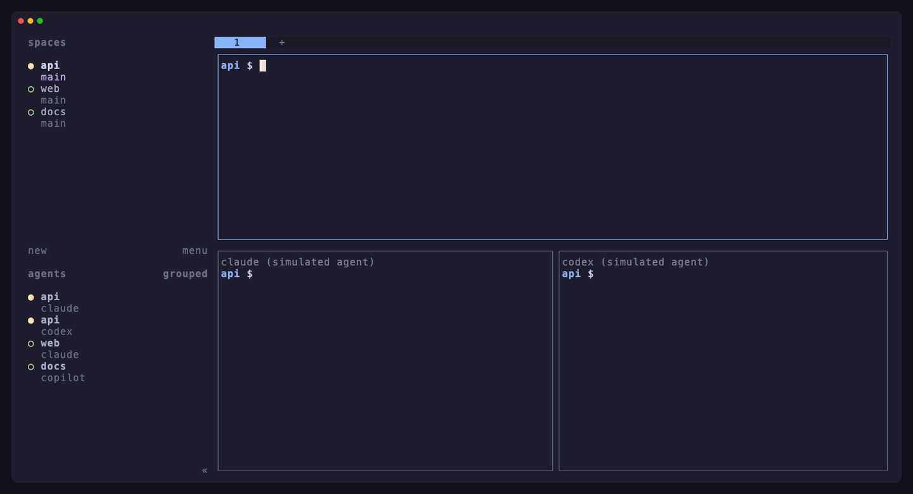

<h1 align="center">herdr-ai-usagebar</h1>

<p align="center">
  <strong>Your AI plan usage, right in the <a href="https://herdr.dev">herdr</a> sidebar.</strong><br>
  Claude, Codex, Copilot and every other provider
  <a href="https://github.com/akitaonrails/ai-usagebar">ai-usagebar</a> tracks, next to the agents spending it.
</p>

<p align="center">
  <a href="https://github.com/agnostk/herdr-ai-usagebar/actions/workflows/ci.yml"></a>
  <a href="https://github.com/agnostk/herdr-ai-usagebar/actions/workflows/ci.yml"></a>
  <a href="https://herdr.dev/plugins"></a>
  <a href="Cargo.toml"></a>
  
  <a href="LICENSE"></a>
</p>

<p align="center">
  
</p>

<p align="center">
  <a href="#quick-start">Quick start</a> ·
  <a href="#what-you-see">What you see</a> ·
  <a href="#actions">Actions</a> ·
  <a href="docs/configuration.md">Configuration</a> ·
  <a href="docs/how-it-works.md">How it works</a> ·
  <a href="docs/troubleshooting.md">Troubleshooting</a>
</p>

Running several coding agents at once makes it easy to burn through a
5-hour window without noticing. This plugin puts
[ai-usagebar](https://github.com/akitaonrails/ai-usagebar)'s quota numbers in
herdr's sidebar, where you already watch your agents. Each agent row shows the
plan *that agent* spends, and each workspace row sums up its agents.

## Features

- **Per-agent usage:** a Claude pane shows Claude's 5h and weekly windows, a
  Codex pane shows Codex's, and so on for
  [ten agents](docs/configuration.md#agent-mapping), including named accounts.
- **Workspace summaries** (`◕ cld 54% · gpt 81%`), or every provider on every
  workspace with `workspace_rows = "all"`.
- **At-a-glance severity:** a pie glyph fills with usage, and the rows turn
  from green to red as a limit approaches. A near-exhausted per-model window
  counts too, even when it isn't one of the windows shown.
- **One-command setup:** `setup-sidebar` edits your herdr config after herdr
  itself validates the change, and keeps a backup.
- **Quiet and self-cleaning:** only changed values are reported, every value
  expires on its own, and the refresher stops when you disable the plugin or
  herdr exits.
- **Nothing new to trust with credentials:** the plugin runs your installed
  `ai-usagebar`, opens no network connections itself, and redacts
  credential-looking text from errors. See [SECURITY.md](SECURITY.md).

## Quick start

You need herdr 0.9.0 or newer on Linux or macOS,
[ai-usagebar](https://github.com/akitaonrails/ai-usagebar#install) set up so
that `ai-usagebar usage --json` lists your providers, and a Rust toolchain
(herdr builds the plugin on install).

```sh
herdr plugin install agnostk/herdr-ai-usagebar
herdr plugin action invoke agnostk.ai-usagebar.setup-sidebar
```

That's it: usage appears within a few seconds. The first command previews
what the plugin will run before it builds; the second adds the `$ai_usage`
rows to your sidebar layout. From then on the refresher starts with herdr.

## What you see

| Where | Example | Shows |
|-------|---------|-------|
| agent row | `◑ 5h 38% · 7d 54%` | the first two usage windows of the agent's provider |
| space row | `◕ cld 54% · gpt 81%` | each provider its agents use, at its highest window |
| any row | `⚠ credentials error` | ai-usagebar could not read that provider |
| any row | `… (stale)` | the latest refresh failed; the previous numbers are shown |

The pie fills with the highest usage across all of a provider's windows:
`○` under 13%, then `◔`, `◑`, `◕`, and `●` from 88%. The plugin also reports
`$ai_usage_pct`, the bare number, for herdr's numeric style rules. See the
[configuration guide](docs/configuration.md#sidebar-layout) for alternative
layouts.

## Actions

| Action | What it does |
|--------|--------------|
| `agnostk.ai-usagebar.setup-sidebar` | add the `$ai_usage` rows to your sidebar layout |
| `agnostk.ai-usagebar.refresh` | fetch usage now, starting the refresher if needed |
| `agnostk.ai-usagebar.dashboard` | open `ai-usagebar-tui` in a popup |
| `agnostk.ai-usagebar.status` | print refresher state to the plugin log |
| `agnostk.ai-usagebar.stop` | stop the refresher and clear the sidebar values |

Run them with `herdr plugin action invoke <action>`, or bind keys. `prefix+u`
is free by default:

```toml
[[keys.command]]
key = "prefix+u"
type = "plugin_action"
command = "agnostk.ai-usagebar.dashboard"
description = "AI usage dashboard"
```

## Configuration

Optional settings live in
`$(herdr plugin config-dir agnostk.ai-usagebar)/config.toml`: the
agent-to-provider mapping, refresh interval, windows per row, and space-row
mode. A commented example is written there on first run. The
[configuration guide](docs/configuration.md) covers every key, the sidebar
layout, and layout recipes.

## How it works

herdr v1 plugins can't draw UI or run timers, but herdr's sidebar renders
custom `$tokens` that plugins report as pane and workspace metadata. The
plugin's startup hook launches a small background refresher, one per herdr
session. It runs `ai-usagebar usage --json` every minute, matches agents to
providers, and reports only what changed. The details, with diagrams, are in
[how it works](docs/how-it-works.md).

## FAQ

**Does it send my usage anywhere?** No. The plugin opens no network
connections. ai-usagebar talks to your providers exactly as it does for its
other frontends, and the values stay in your herdr server's memory.

**Can I see usage when no agent is running?** Yes: set
`workspace_rows = "all"` to show every provider on every workspace row.

**Does it slow herdr down?** In steady state it makes two `herdr … list` calls
every 5 seconds and one ai-usagebar run a minute, which ai-usagebar serves
from its cache most of the time.

**How do I uninstall it?** Run the `stop` action, then
`herdr plugin uninstall agnostk.ai-usagebar`. Unreported tokens render as
nothing, so the sidebar rows can stay; `setup-sidebar` left a backup of your
config if you want the old one back.

More answers in [troubleshooting](docs/troubleshooting.md).

## Contributing

Bug reports, provider mappings and pull requests are welcome. Start with
[CONTRIBUTING.md](CONTRIBUTING.md), and report security issues privately as
described in [SECURITY.md](SECURITY.md). The test suite includes an
end-to-end check that runs the plugin inside a real, sandboxed herdr.

## Acknowledgements

[ai-usagebar](https://github.com/akitaonrails/ai-usagebar) by AkitaOnRails
does the hard part: talking to every provider. [herdr](https://herdr.dev), by
[@ogulcancelik](https://github.com/ogulcancelik), provides the sidebar and the
plugin API. This is an independent
community plugin, not affiliated with either project.

## License

[MIT](LICENSE)
