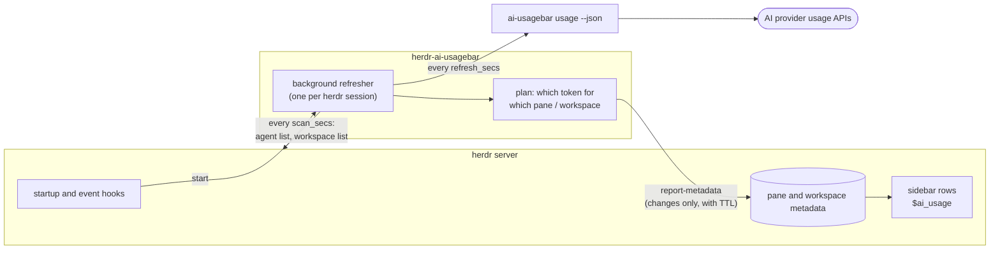
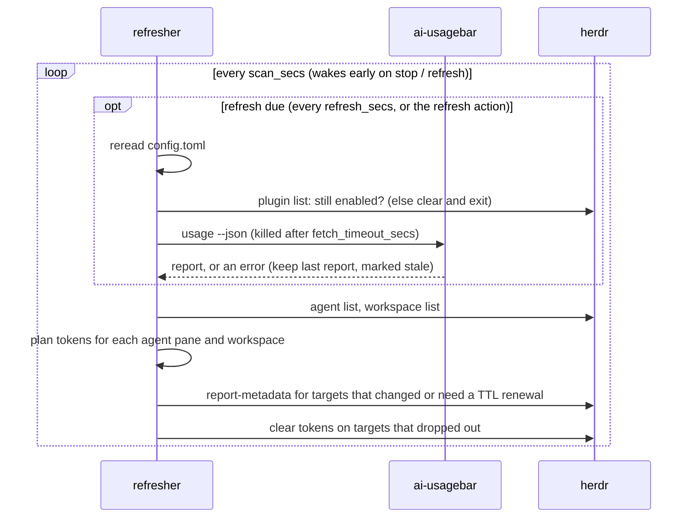
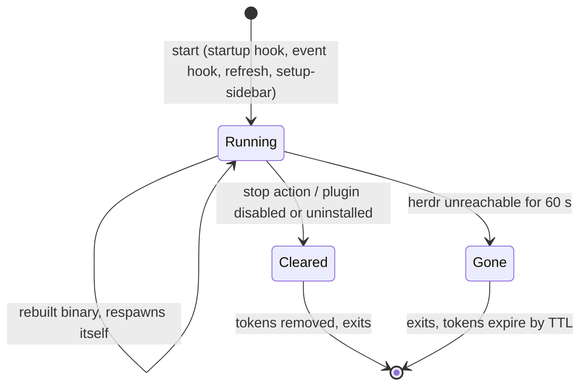

# How it works

herdr v1 plugins cannot draw their own UI or keep a process running between
events. herdr's sidebar can, however, render custom `$tokens` that any
process reports as pane or workspace metadata. The plugin combines the two: a
small background refresher turns ai-usagebar's report into tokens, and your
sidebar layout decides where they appear.

## The refresher

`herdr-plugin.toml` runs `herdr-ai-usagebar start` from its `[[startup]]` hook
and from the `pane.agent_detected`, `workspace.created` and
`workspace.focused` events. The `refresh` and `setup-sidebar` actions start it
too. Startup hooks don't run
when a plugin is first installed or enabled, so the event hooks start it
without waiting for a herdr restart.

`start` spawns the refresher as a detached process in its own process group
and returns immediately. If a refresher already holds the session's lock, it
does nothing, which makes the event hooks cheap no-ops.

Each pass of the refresher:

Planning is pure: each agent's herdr id maps to ai-usagebar entry ids
([agent mapping](configuration.md#agent-mapping)). The first entry that
reports usage becomes the agent row's `$ai_usage`. Each workspace's row sums up
the entries its agents use.

The publisher remembers what it reported. It calls herdr only for targets
whose tokens changed or whose TTL is a third spent, and it clears targets that
no longer have an agent. A steady state costs two `herdr ... list` calls per
scan.

## Lifecycle

- **One per session.** herdr plugins are global to your user, but every herdr
  session (server socket) runs its own startup hook. Each session gets its own
  refresher, keyed by a hash of the socket path, with an exclusive lock that
  the OS releases if the process dies.
- **Self-cleaning.** Every token carries a TTL of
  `3 × (refresh_secs + fetch_timeout_secs + scan_secs)` seconds, about 8
  minutes with defaults. It is renewed after a third of that, so even the
  slowest pass renews it in time, and a killed refresher's values still
  disappear.
- **Hot restart.** The refresher checks its binary on each refresh. After a
  rebuild or reinstall it releases the lock and starts the new binary.

## Why call ai-usagebar instead of linking it?

ai-usagebar publishes `ai-usagebar usage --json` as a versioned,
machine-readable contract for frontends (`schema_version: 1`, with fields
that may be added or omitted). Calling it instead of linking the crate:

- keeps this plugin a ~1 MB binary that builds in seconds on install, without
  the GUI toolkits the ai-usagebar crate pulls in on macOS;
- picks up new ai-usagebar providers and fixes without a plugin release;
- shares ai-usagebar's credentials, cache, rate-limit backoff and quota
  notifications with its other frontends, so the plugin adds no extra
  provider traffic.

## Files

See [SECURITY.md](../SECURITY.md#what-it-writes) for every file the plugin
writes and its permissions.
